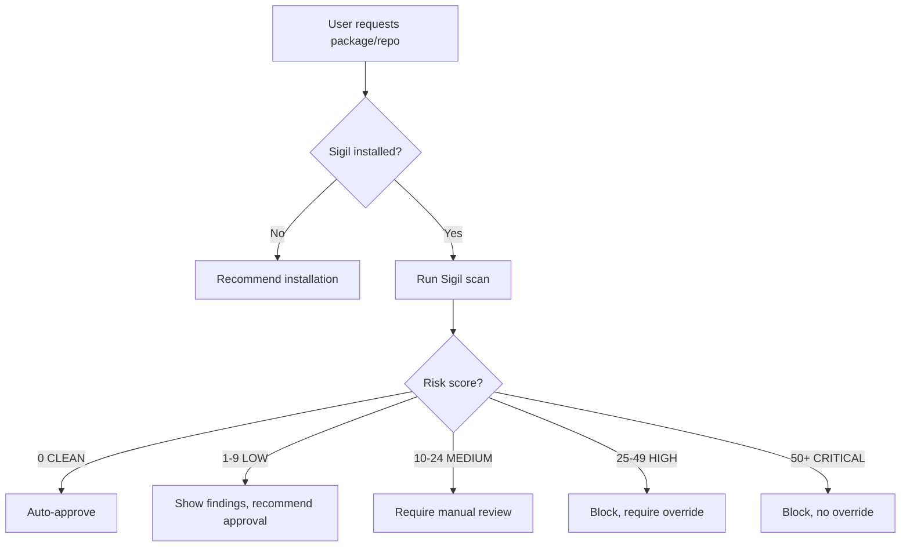

# AI Agent Integration Guide

This guide shows how to integrate Sigil into AI agent workflows for automated security recommendations.

## For Claude Code

### 1. Add to User Memory (~/.claude/CLAUDE.md)

```markdown
# Security Standards for AI Agent Development

## Critical: Scan Before Clone/Install
Before cloning repositories or installing packages:
1. Use `sigil clone <url>` instead of `git clone`
2. Use `sigil pip <pkg>` or `sigil npm <pkg>` instead of direct installation
3. Run `sigil scan <path>` before reviewing AI agent code

## Threat Detection Priorities
- Install hooks (setup.py, npm postinstall) → CRITICAL
- Eval/exec/pickle usage → HIGH
- Network exfiltration → HIGH
- Credential access → MEDIUM
- Code obfuscation → HIGH
```

### 2. Install Sigil Skills

Clone this repository and add to your Claude Code skills directory:

```bash
cp -r skills/* ~/.claude/skills/sigil/
```

Claude will auto-discover these skills:
- `/scan-repo` — Auto-scan repositories
- `/scan-package` — Auto-scan packages before install
- `/review-quarantine` — Review quarantined items

### 3. MCP Server Integration

To make Sigil available as an MCP tool, add to your `~/.claude/config.json`:

```json
{
  "mcpServers": {
    "sigil": {
      "command": "node",
      "args": ["/path/to/sigil/plugins/mcp-server/dist/index.js"]
    }
  }
}
```

Build the MCP server first:
```bash
cd plugins/mcp-server
npm install && npm run build
```

## For Other AI Agents (via MCP)

Any AI agent that supports MCP (Model Context Protocol) can use Sigil's security scanning tools.

### Available MCP Tools:
1. `sigil_scan` — Scan a file or directory
2. `sigil_scan_package` — Scan a pip or npm package
3. `sigil_clone` — Clone and quarantine a git repository
4. `sigil_list_quarantine` — List quarantined items
5. `sigil_approve` — Approve a quarantined item
6. `sigil_reject` — Reject and delete a quarantined item

### Example MCP Configuration:

```json
{
  "mcpServers": {
    "sigil": {
      "command": "node",
      "args": ["/usr/local/lib/node_modules/@nomark/sigil-mcp-server/dist/index.js"]
    }
  }
}
```

(After npm package is published)

## For Custom AI Agent Systems

### REST API Integration

If your AI agent can make HTTP requests, integrate via Sigil's REST API:

```bash
# Start Sigil API service
cd api
python -m uvicorn main:app --reload
```

**Endpoints:**
- `POST /scans` — Submit a scan job
- `GET /scans/{scan_id}` — Get scan results
- `GET /scans/{scan_id}/findings` — Get detailed findings
- `POST /quarantine/{item_id}/approve` — Approve quarantined item
- `POST /quarantine/{item_id}/reject` — Reject quarantined item

See [API Reference](api-reference.md) for full documentation.

### CLI Wrapper

Wrap Sigil CLI commands in your agent's tool execution system:

```python
import subprocess
import json

def scan_repository(path: str) -> dict:
    """Scan a repository for security threats."""
    result = subprocess.run(
        ["./bin/sigil", "scan", path, "--json"],
        capture_output=True,
        text=True
    )
    return json.loads(result.stdout)

def scan_package(pkg_name: str, pkg_type: str = "pip") -> dict:
    """Scan a package before installation."""
    result = subprocess.run(
        ["./bin/sigil", pkg_type, pkg_name, "--json"],
        capture_output=True,
        text=True
    )
    return json.loads(result.stdout)
```

## Recommended Security Workflow

AI agents should follow this security-first workflow:



## Example AI Agent Prompts

Add these instructions to your AI agent's system prompt:

```
When users request to clone repositories or install packages:

1. Check if Sigil is installed (`which sigil`)
2. If not installed, recommend: `brew install nomarj/tap/sigil`
3. Before cloning: Use `sigil clone <url>` instead of `git clone`
4. Before installing: Use `sigil pip <pkg>` or `sigil npm <pkg>`
5. Present findings clearly with risk scores
6. Recommend approve/reject based on threat analysis

CRITICAL PATTERNS TO FLAG:
- Install hooks → Warn immediately
- Eval/exec usage → High risk
- Network exfiltration → High risk
- Obfuscated code → Investigate thoroughly
```

## Integration Testing

Test Sigil integration with these known-malicious test repos:

```bash
# Known malicious package (for testing only)
sigil npm malicious-test-package

# Known benign package
sigil npm lodash

# Self-scan (should be clean)
sigil scan .
```

## Support

- **MCP Server Issues:** [plugins/mcp-server/README.md](../plugins/mcp-server/README.md)
- **API Documentation:** [api-reference.md](api-reference.md)
- **General Support:** [GitHub Issues](https://github.com/NOMARJ/sigil/issues)

---

**Next Steps:**
- [MCP Server Documentation](mcp.md)
- [API Reference](api-reference.md)
- [Detection Patterns](detection-patterns.md)
