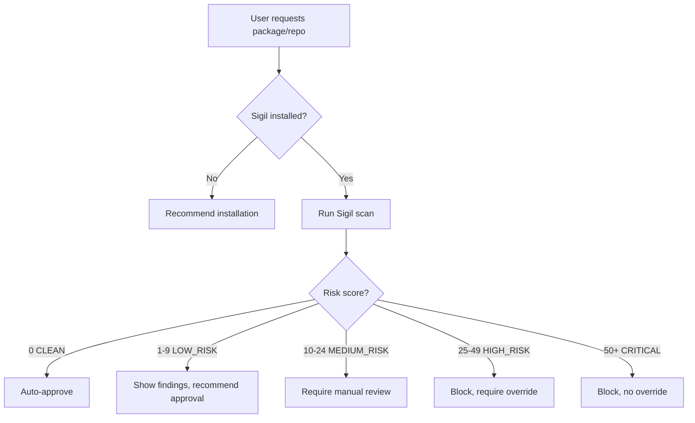

# AI Agent Integration Guide

This guide shows how to integrate Sigil into AI agent workflows for automated security recommendations.

## For Claude Code

### Install the Plugin (Recommended — One Command)

The Sigil plugin makes security enforcement the default, not a suggestion:

```bash
claude plugin marketplace add NOMARJ/sigil
claude plugin install sigil-security@sigil-marketplace
```

That single install gives you everything:

- **Enforcement gate** — a PreToolUse hook blocks `git clone`, `npm install <pkg>`, `pip install <pkg>`, and curl-pipe-to-shell inside Claude Code sessions, redirecting them through Sigil's quarantine-first equivalents. Lockfile restores and one-shot runners (`npx`, `dlx`) prompt for confirmation. Override per-command with `SIGIL_BYPASS=1`, or set `SIGIL_GUARD_MODE=advise|off` to soften or disable it
- **MCP server** — `@nomark/sigil-mcp-server` is registered automatically, exposing Sigil's scanning tools to Claude directly. The automatic `npx`-based registration takes effect once the package is published to npm (v1.3.0 is not yet published); until then, build from source and register it manually — see the note below
- **6 skills** — `/sigil-security:scan-repo`, `scan-package`, `scan-file`, `review-quarantine`, `fix-finding`, `generate-policy`
- **2 agents** — `@security-auditor` and `@quarantine-manager`
- **Session check** — a SessionStart hook verifies the `sigil` binary is installed

See the [Claude Code plugin guide](claude-code-plugin.md) for details.

### Optional: Add to User Memory (~/.claude/CLAUDE.md)

To reinforce the workflow in projects where the plugin isn't installed:

```markdown
# Security Standards for AI Agent Development

## Critical: Scan Before Clone/Install
Before cloning repositories or installing packages:
1. Use `sigil clone <url>` instead of `git clone`
2. Use `sigil pip <pkg>` or `sigil npm <pkg>` instead of direct installation
3. Run `sigil scan <path>` before reviewing AI agent code

## Threat Detection Priorities
- Install hooks (setup.py, npm postinstall) → CRITICAL
- Prompt injection in agent code/docs → CRITICAL
- Eval/exec/pickle usage → HIGH
- Network exfiltration → HIGH
- Code obfuscation → HIGH
- Skill/MCP permission escalation → HIGH
- Credential access → MEDIUM
```

## For Other AI Agents (via MCP)

Any AI agent that supports MCP (Model Context Protocol) can use Sigil's security scanning tools.

### Available MCP Tools:
1. `sigil_scan` — Scan a file or directory
2. `sigil_scan_package` — Scan a pip or npm package
3. `sigil_clone` — Clone and quarantine a git repository
4. `sigil_quarantine` — List quarantined items
5. `sigil_approve` — Approve a quarantined item
6. `sigil_reject` — Reject and delete a quarantined item
7. `sigil_check_package` — Look up a package/skill in the public scan database
8. `sigil_search_database` — Search the public scan database
9. `sigil_report_threat` — Report a malicious file by SHA256 hash

### Example MCP Configuration:

```json
{
  "mcpServers": {
    "sigil": {
      "command": "npx",
      "args": ["-y", "@nomark/sigil-mcp-server"]
    }
  }
}
```

> **Note**: `@nomark/sigil-mcp-server` v1.3.0 is not yet published to npm — the `npx` config above will work once it is. Until then, build from source (`cd plugins/mcp-server && npm install && npm run build`) and use `"command": "node", "args": ["/path/to/sigil/plugins/mcp-server/dist/index.js"]` instead.

See the [MCP integration guide](mcp.md) for full tool schemas and environment variables (`SIGIL_BINARY`, `SIGIL_API_URL`).

## For Custom AI Agent Systems

### REST API Integration

If your AI agent can make HTTP requests, integrate via Sigil's REST API:

```bash
# Start Sigil API service
cd api
python -m uvicorn main:app --reload
```

**Production API Base URL:** `https://api.sigilsec.ai`

**Key Endpoints:**
- `POST /v1/scans` — Submit a scan job
- `GET /v1/scans/{scan_id}` — Get scan results  
- `GET /v1/scans/{scan_id}/findings` — Get detailed findings
- `POST /v1/quarantine/{item_id}/approve` — Approve quarantined item
- `POST /v1/quarantine/{item_id}/reject` — Reject quarantined item
- `GET /v1/health` — API health check

**Authentication:** Include `Authorization: Bearer <jwt_token>` header for authenticated endpoints.

See [API Reference](api-reference.md) for full documentation.

### CLI Wrapper

Wrap Sigil CLI commands in your agent's tool execution system:

```python
import subprocess
import json

def scan_repository(path: str) -> dict:
    """Scan a repository for security threats."""
    result = subprocess.run(
        ["sigil", "--format", "json", "scan", path],
        capture_output=True,
        text=True
    )
    return json.loads(result.stdout)

def scan_package(pkg_name: str, pkg_type: str = "pip") -> dict:
    """Scan a package before installation."""
    result = subprocess.run(
        ["sigil", "--format", "json", pkg_type, pkg_name],
        capture_output=True,
        text=True
    )
    return json.loads(result.stdout)
```

## Recommended Security Workflow

AI agents should follow this security-first workflow:


```mermaid
graph TD
    A[User requests package/repo] --> B{Sigil installed?}
    B -->|No| C[Recommend installation]
    B -->|Yes| D[Run Sigil scan]
    D --> E{Risk score?}
    E -->|0 CLEAN| F[Auto-approve]
    E -->|1-9 LOW_RISK| G[Show findings, recommend approval]
    E -->|10-24 MEDIUM_RISK| H[Require manual review]
    E -->|25-49 HIGH_RISK| I[Block, require override]
    E -->|50+ CRITICAL| J[Block, no override]
```

## Example AI Agent Prompts

Add these instructions to your AI agent's system prompt:

```
When users request to clone repositories or install packages:

1. Check if Sigil is installed (`which sigil`)
2. If not installed, recommend: `brew install nomarj/tap/sigil`
3. Before cloning: Use `sigil clone <url>` instead of `git clone`
4. Before installing: Use `sigil pip <pkg>` or `sigil npm <pkg>`
5. Present findings clearly with risk scores
6. Recommend approve/reject based on threat analysis

CRITICAL PATTERNS TO FLAG:
- Install hooks → Warn immediately
- Eval/exec usage → High risk
- Network exfiltration → High risk
- Obfuscated code → Investigate thoroughly
```

## Integration Testing

Test Sigil integration with these known-malicious test repos:

```bash
# Known malicious package (for testing only)
sigil npm malicious-test-package

# Known benign package
sigil npm lodash

# Self-scan (should be clean)
sigil scan .
```

## Support

- **MCP Server Issues:** [plugins/mcp-server/README.md](../plugins/mcp-server/README.md)
- **API Documentation:** [api-reference.md](api-reference.md)
- **General Support:** [GitHub Issues](https://github.com/NOMARJ/sigil/issues)

---

**Next Steps:**
- [MCP Server Documentation](mcp.md)
- [API Reference](api-reference.md)
- [Detection Patterns](detection-patterns.md)
