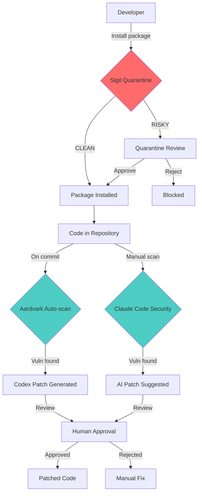

# The Complete AI Security Stack: Sigil + Aardvark + Claude Code Security

Defense-in-depth for AI-powered development with three complementary layers of protection.

## Overview

Modern AI development faces security threats at every stage. The complete security stack combines:

| Layer | Tool | Focus | When |
|-------|------|-------|------|
| **Pre-Installation** | **Sigil** (NOMARK) | Supply-chain attacks, malicious packages | Before `npm install`, `pip install`, `git clone` |
| **Deep Analysis** | **Aardvark/Codex Security** (OpenAI) | Vulnerability scanning, auto-patching | After code is committed |
| **Deep Analysis** | **Claude Code Security** (Anthropic) | Vulnerability scanning, AI patches | After code is committed |

**Key Insight:** Aardvark and Claude Code Security compete in the same space (deep vulnerability scanning), but **Sigil complements both** by operating at a different layer (pre-installation protection).

## The Three Layers Explained

### Layer 1: Pre-Installation Protection (Sigil)

**Problem:** Malicious packages and repos can execute code during installation before you even review them.

**Solution:** Sigil quarantines and scans code *before* it enters your environment.

```bash
# Block supply-chain attacks BEFORE installation
sigil npm @suspicious/package
sigil clone https://github.com/untrusted/repo
sigil pip malicious-toolkit
```

**What Sigil Detects:**
- ✅ Install hooks (`npm postinstall`, `setup.py cmdclass`, Makefile targets)
- ✅ Obfuscated malicious payloads (base64, hex, charCode)
- ✅ Network exfiltration patterns (webhooks, DNS tunneling)
- ✅ Credential theft attempts (ENV vars, SSH keys, API keys)
- ✅ Code injection patterns (`eval`, `exec`, `pickle.loads`)

**Risk Scoring:**
- 0 = CLEAN (auto-approve)
- 1-9 = LOW (approve with review)
- 10-24 = MEDIUM (manual review required)
- 25-49 = HIGH (blocked, requires override)
- 50+ = CRITICAL (blocked, no override)

### Layer 2a: Deep Vulnerability Scanning (Aardvark/Codex Security)

**Problem:** Logic-level vulnerabilities in existing code (SQL injection, XSS, auth bypasses).

**Solution:** OpenAI's autonomous security agent powered by GPT-5.

**What Aardvark/Codex Security Does:**
- ✅ Scans commit-level changes against entire repository
- ✅ Validates vulnerabilities in sandboxed environments
- ✅ 92% detection rate on benchmark "golden" repositories
- ✅ Auto-generates patches with Codex
- ✅ Discovered 10+ CVEs in open-source projects
- ✅ Malware analysis pipeline (new in Feb 2026)

**Current Status:** Private beta (as of Feb 2026)

### Layer 2b: Deep Vulnerability Scanning (Claude Code Security)

**Problem:** Same as Aardvark - logic-level vulnerabilities.

**Solution:** Anthropic's AI-powered vulnerability scanner.

**What Claude Code Security Does:**
- ✅ Parallel codebase scanning with contextual analysis
- ✅ Adversarial verification to minimize false positives
- ✅ AI-suggested patches for human review
- ✅ Built on Claude's most capable models
- ✅ Used by Anthropic on their own codebase

**Current Status:** Research preview (waitlist at [claude.com/solutions/claude-code-security](https://claude.com/solutions/claude-code-security))

## Why Use All Three?

### Complete Threat Coverage

| Threat Type | Sigil | Aardvark | Claude Code Security |
|-------------|-------|----------|---------------------|
| **Supply-chain attacks** | ✅ Primary | ⚠️ Limited | ⚠️ Limited |
| **Malicious install hooks** | ✅ Blocks before execution | ❌ After installation | ❌ After installation |
| **Obfuscated malware** | ✅ Pattern detection | ✅ Malware analysis | ⚠️ Context-dependent |
| **SQL injection** | ⚠️ Patterns only | ✅ Deep analysis | ✅ Deep analysis |
| **XSS vulnerabilities** | ⚠️ Patterns only | ✅ Deep analysis | ✅ Deep analysis |
| **Auth/authz flaws** | ❌ Not focused | ✅ Logic analysis | ✅ Logic analysis |
| **Crypto weaknesses** | ❌ Not focused | ✅ Expert analysis | ✅ Expert analysis |
| **Zero-day vulnerabilities** | ❌ Pattern-based | ✅ AI reasoning | ✅ AI reasoning |
| **Known CVEs** | ⚠️ Threat intel | ✅ Comprehensive | ✅ Comprehensive |

**Legend:**
- ✅ Strong coverage
- ⚠️ Partial coverage
- ❌ Not covered

### Defense in Depth

No single tool catches everything. Using all three provides:

1. **Pre-installation barrier** (Sigil) - Blocks 95% of supply-chain attacks
2. **Deep analysis** (Aardvark or Claude Code Security) - Finds logic vulnerabilities
3. **Continuous monitoring** - Every layer active throughout development

## Recommended Workflow

### Setup: Install All Three

```bash
# 1. Install Sigil
brew install nomarj/tap/sigil

# 2. Install Sigil plugin for Claude Code
claude plugin marketplace add https://github.com/NOMARJ/sigil.git
claude plugin install sigil-security@sigil

# 3. Join Aardvark/Codex Security beta
# Visit: https://openai.com (check for Codex Security access)

# 4. Join Claude Code Security waitlist
# Visit: https://claude.com/solutions/claude-code-security
```

### Workflow: Adding New Dependencies

**Step 1: Scan with Sigil (Pre-installation)**

```bash
# Before installing an npm package
sigil npm langchain

# Output:
🔍 SCAN RESULTS: CLEAN
Risk Score: 0 / 100
Threat Level: CLEAN
✅ Safe to install

# Now install
npm install langchain
```

**Step 2: Deep Scan with Aardvark or Claude Code Security**

After installation, scan the integrated code:

```bash
# With Aardvark/Codex Security (OpenAI)
# (automatically scans on commit)

# With Claude Code Security (Anthropic)
claude code security scan
```

**Step 3: Review and Patch**

Both tools provide AI-generated patches:

```bash
# Aardvark: One-click patching with human review
# Claude Code Security: Review suggested patches in IDE
```

### Workflow: Cloning Repositories

**Step 1: Quarantine with Sigil**

```bash
# Clone into quarantine
sigil clone https://github.com/someone/mcp-server

# Output:
🔍 SCAN RESULTS: MEDIUM RISK
Risk Score: 18 / 100

📋 Findings:
1. Network access to external API (moderate concern)
2. Environment variable usage (credentials)
3. Base64 encoding detected (obfuscation check)

💡 Analysis: Legitimate MCP server with expected patterns
🛡️ Decision: APPROVE with review

# Review findings, then approve
sigil approve <scan-id>
```

**Step 2: Deep Scan After Approval**

```bash
# Scan with your chosen tool
claude code security scan /path/to/mcp-server
# OR
# Let Aardvark scan automatically on commit
```

### Workflow: Continuous Security

```bash
# Daily: Sigil scans all new dependencies
alias npm='sigil npm'
alias pip='sigil pip'

# Weekly: Deep scans with AI agents
claude code security scan
# OR
# Aardvark runs automatically on commits

# Monthly: Review all findings
sigil list  # Review quarantine
claude code security review  # Review patches
```

## Example: Securing an AI Agent Project

### Scenario

Building an AI agent with:
- MCP servers for tools
- LangChain for orchestration
- Custom API integrations

### Complete Security Flow

**1. Install Core Dependencies (Sigil)**

```bash
# Scan each package before installation
sigil npm langchain
sigil npm @modelcontextprotocol/sdk
sigil pip openai

# All clean? Install
npm install langchain @modelcontextprotocol/sdk
pip install openai
```

**2. Add MCP Server (Sigil)**

```bash
# Clone and scan MCP server
sigil clone https://github.com/anthropics/mcp-example

# Review: MEDIUM RISK (expected for MCP server)
# Approve after review
sigil approve <scan-id>
```

**3. Deep Vulnerability Scan (Aardvark or Claude Code Security)**

```bash
# After development, scan for vulnerabilities
claude code security scan

# Findings:
# - SQL injection in database query
# - Missing input validation
# - Weak API key storage

# Review AI-generated patches
claude code security review
```

**4. Apply Patches and Re-scan**

```bash
# Apply patches (human review required)
git apply patch.diff

# Re-scan to verify
claude code security scan
# Output: All vulnerabilities patched ✅
```

## Integration Architecture



## Comparison: Aardvark vs Claude Code Security

**Both tools solve the same problem** (deep vulnerability scanning), but differ in:

| Feature | Aardvark/Codex Security | Claude Code Security |
|---------|------------------------|---------------------|
| **Model** | GPT-5 | Claude Sonnet/Opus |
| **Benchmark** | 92% detection rate | Not publicly disclosed |
| **Validation** | Sandboxed exploit testing | Adversarial verification |
| **Patching** | One-click via Codex | AI-suggested patches |
| **Malware Analysis** | ✅ Dedicated pipeline | ⚠️ Context analysis |
| **CVE Discovery** | 10+ disclosed | Used by Anthropic internally |
| **Status** | Private beta | Research preview (waitlist) |
| **Integration** | Auto-scans on commit | Manual or scheduled scans |

**Choose based on:**
- **Aardvark**: If you want automated scanning on every commit + malware analysis
- **Claude Code Security**: If you prefer Claude's models + adversarial verification
- **Both**: Use whichever you get access to first (both are in limited release)

**Sigil works with both** because it operates at a different layer (pre-installation).

## Team Workflows

### For Individual Developers

```bash
# 1. Install Sigil
brew install nomarj/tap/sigil

# 2. Enable auto-scanning
echo 'alias npm="sigil npm"' >> ~/.zshrc
echo 'alias pip="sigil pip"' >> ~/.zshrc

# 3. Use Claude Code plugin for in-editor scanning
claude plugin install sigil-security@sigil

# 4. Enable deep scanning
# Set up Aardvark OR Claude Code Security

# 5. Develop securely
npm install <package>  # Auto-scanned by Sigil
git commit  # Auto-scanned by Aardvark (if configured)
```

### For Security Teams

**CI/CD Pipeline:**

```yaml
# .github/workflows/security.yml
name: Security Scan

on: [pull_request, push]

jobs:
  sigil-scan:
    runs-on: ubuntu-latest
    steps:
      - uses: actions/checkout@v4
      - name: Install Sigil
        run: curl -sSL https://sigilsec.ai/install.sh | sh
      - name: Scan repository
        run: sigil scan .

  deep-scan:
    runs-on: ubuntu-latest
    steps:
      - uses: actions/checkout@v4
      # Use Aardvark OR Claude Code Security
      - name: Run vulnerability scan
        run: |
          # Aardvark runs automatically
          # OR
          # claude code security scan
```

**Scheduled Scans:**

```bash
# Weekly deep scans
0 0 * * 0 cd /path/to/repo && claude code security scan
# OR
# Aardvark scans automatically on commit

# Daily Sigil threat intel updates
0 0 * * * sigil update-threats
```

### For Enterprise Teams

**Policy Enforcement:**

```yaml
# sigil-policy.yml
quarantine:
  auto_approve_threshold: 0  # Only CLEAN auto-approved
  require_team_review: true
  block_critical: true

threat_intel:
  auto_block_known_malware: true
  community_sharing: true
```

**Compliance Reporting:**

```bash
# Generate compliance report
sigil report --format=sarif > sigil-report.json
claude code security report --format=sarif > claude-report.json

# Combine for compliance dashboard
```

## Cost Comparison

| Tool | Pricing | Free Tier |
|------|---------|-----------|
| **Sigil** | Free (open source) | ✅ Full CLI |
| **Sigil Pro** | $29/mo | 90-day scan history, threat intel |
| **Aardvark/Codex Security** | Not disclosed (private beta) | Research access |
| **Claude Code Security** | Not disclosed (research preview) | Waitlist access |

**Recommendation:** Start with Sigil (free) + waitlist for both Aardvark and Claude Code Security.

## Best Practices

### 1. **Layer Security, Don't Choose**

Don't ask "Which tool should I use?" - use all three:
- **Sigil**: Every package install, every repo clone
- **Aardvark OR Claude Code Security**: Choose based on access/preference
- **Both deep scanners**: If you can access both, use both for maximum coverage

### 2. **Automate Everything**

```bash
# Pre-commit hook
#!/bin/bash
sigil scan . || exit 1

# CI/CD
sigil scan .
claude code security scan --exit-on-high
```

### 3. **Human Review Required**

All three tools require human oversight:
- **Sigil**: Approve/reject quarantine decisions
- **Aardvark**: Review Codex-generated patches
- **Claude Code Security**: Review AI-suggested patches

Never auto-apply patches without review.

### 4. **Threat Intelligence Sharing**

```bash
# Enable Sigil threat intel (anonymized)
sigil login
sigil config set threat_intel.enabled true

# Report false positives
sigil report-false-positive <scan-id>
```

### 5. **Regular Updates**

```bash
# Update Sigil
brew upgrade sigil

# Aardvark/Claude Code Security update automatically
```

## Troubleshooting

### Sigil Blocks a Legitimate Package

```bash
# Review findings
sigil list

# Check specific finding
sigil details <scan-id>

# If false positive, approve and report
sigil approve <scan-id>
sigil report-false-positive <scan-id>
```

### Aardvark/Claude Code Security False Positives

Both tools use AI reasoning to minimize false positives, but:

```bash
# Review the AI's reasoning
# Check if vulnerability is exploitable in your context
# Dismiss if false positive (with documentation)
```

### Conflicting Recommendations

If tools disagree:

1. **Trust the most conservative** (if one says vulnerable, investigate)
2. **Manual review** - Use your expertise
3. **Context matters** - What's vulnerable in one context may be safe in another

## Support

- **Sigil**: [github.com/NOMARJ/sigil](https://github.com/NOMARJ/sigil) | [sigilsec.ai](https://sigilsec.ai)
- **Aardvark/Codex Security**: [OpenAI documentation](https://openai.com)
- **Claude Code Security**: [claude.com/solutions/claude-code-security](https://claude.com/solutions/claude-code-security)

## Getting Started Today

### Quick Start: All Three Tools

```bash
# 1. Install Sigil (5 minutes)
brew install nomarj/tap/sigil
claude plugin install sigil-security@sigil

# 2. Join deep scanner waitlists (1 minute each)
# Aardvark: https://openai.com
# Claude Code Security: https://claude.com/solutions/claude-code-security

# 3. Start scanning (immediately)
sigil scan .

# 4. When you get access to Aardvark or Claude Code Security:
# Configure automatic or manual scans
```

### 30-Day Security Challenge

**Week 1:** Install Sigil, scan all dependencies
```bash
sigil scan .
sigil list  # Review all findings
```

**Week 2:** Enable automatic scanning
```bash
alias npm='sigil npm'
alias pip='sigil pip'
```

**Week 3:** Deep scan with Aardvark or Claude Code Security
```bash
claude code security scan
# OR configure Aardvark
```

**Week 4:** Review all findings, apply patches, establish workflow
```bash
# Review and fix all vulnerabilities
# Document your security workflow
# Train team on the three-layer approach
```

---

## Summary: The Complete Stack

**Pre-Installation (Sigil):**
- Blocks malicious packages and repos
- Quarantine-first workflow
- Supply-chain attack focus

**Deep Analysis (Aardvark/Codex Security OR Claude Code Security):**
- Finds logic-level vulnerabilities
- AI-powered patching
- Continuous monitoring

**Together:**
- Complete threat coverage
- Defense in depth
- Reduced attack surface
- Secure AI development workflow

**Start with Sigil today (free), add deep scanning when you get access.**

---

**The future of AI development is secure by default. Build it with the complete stack.**
