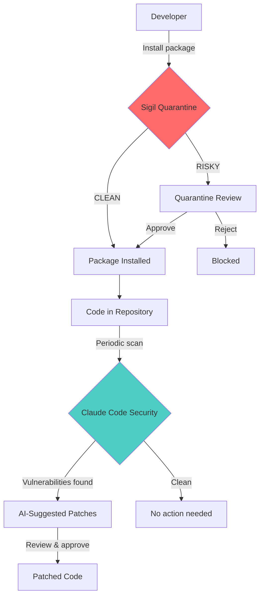

# Sigil + Claude Code Security Integration

Complete security coverage for AI-powered development with Sigil's quarantine-first workflow and Claude Code Security's deep vulnerability scanning.

## Overview

**Sigil** and **Claude Code Security** work together to provide defense-in-depth for your development workflow:

| Layer | Tool | Protection |
|-------|------|------------|
| **Pre-Installation** | Sigil | Scan packages, repos, and AI tools *before* they enter your environment |
| **In-Repository** | Claude Code Security | Deep vulnerability analysis and AI-suggested patches for existing code |

## Why Use Both?

### Sigil: Quarantine-First Protection

Prevents malicious code from ever entering your environment:

```bash
# Block supply-chain attacks BEFORE installation
sigil npm suspicious-package
sigil clone https://github.com/untrusted/mcp-server
sigil pip ai-agent-toolkit
```

**Detects:**
- Install hooks (npm postinstall, setup.py cmdclass)
- Obfuscated payloads
- Network exfiltration attempts
- Credential theft patterns
- Code injection vectors

### Claude Code Security: Deep Analysis

Scans your existing codebase for vulnerabilities:

```bash
# Analyze code already in your repository
claude code security scan
```

**Detects:**
- SQL injection vulnerabilities
- XSS attack vectors
- Authentication bypasses
- Authorization flaws
- Cryptographic weaknesses

## Recommended Workflow

### 1. **Before Adding Dependencies** (Sigil)

```bash
# Installing a new npm package
sigil npm @anthropic/sdk

# Output:
🔍 SCAN RESULTS: CLEAN
Risk Score: 0 / 100
✅ Safe to install
```

### 2. **Before Cloning Repositories** (Sigil)

```bash
# Cloning an MCP server from GitHub
sigil clone https://github.com/someone/postgres-mcp

# Output:
🔍 SCAN RESULTS: MEDIUM RISK
Risk Score: 18 / 100

📋 Findings:
- Network access to PostgreSQL (expected for DB integration)
- Environment variable usage (DB credentials)

💡 Analysis: Legitimate database integration
🛡️ Decision: APPROVE with review
```

### 3. **After Code is in Repository** (Claude Code Security)

```bash
# Scan your codebase for vulnerabilities
claude code security scan

# Claude analyzes and suggests patches
```

### 4. **During Development** (Both)

**Use Sigil Plugin in Claude Code:**
```
/sigil-security:scan-package lodash
@security-auditor analyze this dependency
```

**Use Claude Code Security for code review:**
```
claude code security validate src/auth.py
```

## Integration Architecture



## Example: Securing an AI Agent Project

### Step 1: Scan Dependencies Before Installation

```bash
# Check each dependency with Sigil
sigil npm langchain
sigil pip openai
sigil npm @modelcontextprotocol/sdk

# All clean? Install safely
npm install langchain
pip install openai
npm install @modelcontextprotocol/sdk
```

### Step 2: Scan Cloned MCP Servers

```bash
# Before using an MCP server
sigil clone https://github.com/anthropics/mcp-example

# Review findings
sigil list
sigil approve <scan-id>
```

### Step 3: Deep Vulnerability Scan

```bash
# After development, scan the project
claude code security scan

# Review AI-suggested patches
claude code security review
```

## Configuration

### Sigil Configuration

Enable automatic scanning in your shell (`.bashrc` or `.zshrc`):

```bash
# Auto-scan before install
alias npm='sigil npm'
alias pip='sigil pip'
alias git clone='sigil clone'
```

### Claude Code Security Configuration

(Follow Anthropic's documentation for Claude Code Security setup)

## Team Workflow

### For Individual Developers

1. **Install Sigil plugin for Claude Code**
   ```bash
   claude plugin marketplace add https://github.com/NOMARJ/sigil.git
   claude plugin install sigil-security@sigil
   ```

2. **Use Sigil for all package installations**
3. **Run Claude Code Security scans before PRs**

### For Security Teams

1. **Enforce Sigil in CI/CD** (GitHub Actions)
   ```yaml
   - name: Scan dependencies
     run: sigil scan .
   ```

2. **Schedule Claude Code Security scans**
   ```bash
   # Weekly vulnerability scans
   claude code security scan --schedule weekly
   ```

3. **Review both Sigil and Claude Code Security reports**

## Threat Coverage Comparison

| Threat Type | Sigil | Claude Code Security |
|-------------|-------|---------------------|
| **Supply-chain attacks** | ✅ Primary focus | ⚠️ Limited |
| **Malicious install hooks** | ✅ Detects before execution | ❌ After installation |
| **Code injection (SQL, XSS)** | ⚠️ Pattern-based | ✅ Contextual analysis |
| **Authentication flaws** | ❌ Not focused | ✅ Deep analysis |
| **Credential exfiltration** | ✅ Network pattern detection | ✅ Logic analysis |
| **Obfuscated malware** | ✅ Base64, hex, charCode | ⚠️ Depends on context |
| **Zero-day vulnerabilities** | ❌ Pattern-based only | ✅ AI reasoning |
| **Known CVEs** | ⚠️ Via threat intel | ✅ Comprehensive |

**Legend:**
- ✅ Strong coverage
- ⚠️ Partial coverage
- ❌ Not covered

## Best Practices

### 1. **Defense in Depth**

Don't rely on just one tool:
- Use **Sigil** for supply-chain protection
- Use **Claude Code Security** for vulnerability analysis
- Use both for comprehensive coverage

### 2. **Automate Where Possible**

```bash
# Pre-commit hook with Sigil
#!/bin/bash
sigil scan . || exit 1

# CI/CD with Claude Code Security
claude code security scan --exit-on-high
```

### 3. **Regular Scans**

- **Sigil**: Every package installation, every repo clone
- **Claude Code Security**: Weekly full scans, PR-triggered scans

### 4. **Team Training**

Ensure developers understand:
- When to use Sigil (before adding dependencies)
- When to use Claude Code Security (analyzing existing code)
- How to interpret findings from both tools

## Support

- **Sigil**: [github.com/NOMARJ/sigil](https://github.com/NOMARJ/sigil)
- **Claude Code Security**: [claude.com/solutions/claude-code-security](https://claude.com/solutions/claude-code-security)

## Getting Started

### Quick Start: Both Tools

```bash
# 1. Install Sigil
brew install nomarj/tap/sigil

# 2. Install Sigil plugin for Claude Code
claude plugin marketplace add https://github.com/NOMARJ/sigil.git
claude plugin install sigil-security@sigil

# 3. Join Claude Code Security waitlist
# Visit: https://claude.com/solutions/claude-code-security

# 4. Start protecting your codebase
sigil scan .
claude code security scan
```

---

**Together, Sigil and Claude Code Security provide complete protection** for AI-powered development workflows, from supply-chain security to deep vulnerability analysis.
