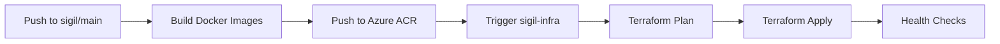

# Sigil Deployment Workflow

## Overview

Sigil uses a two-repository CI/CD workflow to automatically build, test, and deploy infrastructure changes:

1. **sigil** (main repo) - Application code and Docker image builds
2. **sigil-infra** (private repo) - Terraform infrastructure as code

## How It Works



### Workflow Steps

1. **Code Push to `sigil` repo**
   - Developer pushes code to `main` branch
   - Changes to `api/` or `dashboard/` trigger the workflow

2. **Build Phase** (`deploy-azure.yml` in sigil repo)
   - Builds Docker images for API and Dashboard
   - Tags images with commit SHA and `latest`
   - Pushes to Azure Container Registry (ACR)

3. **Trigger Infrastructure Deployment**
   - Sends repository dispatch event to `sigil-infra` repo
   - Passes image tags and metadata

4. **Infrastructure Deployment** (`deploy.yml` in sigil-infra repo)
   - Runs `terraform plan` to preview changes
   - Applies changes if approved
   - Updates Container Apps with new images

5. **Health Checks**
   - Verifies API `/health` endpoint
   - Checks Dashboard accessibility

## Required GitHub Secrets

### In `sigil` repository:

| Secret | Description | How to Get |
|--------|-------------|------------|
| `AZURE_CREDENTIALS` | Azure service principal credentials | See "Azure Setup" below |
| `SUPABASE_URL` | Supabase project URL | From Supabase dashboard |
| `SUPABASE_ANON_KEY` | Supabase anonymous key | From Supabase dashboard |
| `INFRA_REPO_PAT` | Personal Access Token for sigil-infra | GitHub Settings → Developer Settings → PATs |

### In `sigil-infra` repository:

| Secret | Description | How to Get |
|--------|-------------|------------|
| `AZURE_CREDENTIALS` | Azure service principal credentials | See "Azure Setup" below |
| `TF_VAR_*` | Terraform variables | See terraform.tfvars.example |

## Azure Setup

### Create Service Principal

```bash
# Create service principal with Contributor role
az ad sp create-for-rbac \
  --name "sigil-github-actions" \
  --role contributor \
  --scopes /subscriptions/<SUBSCRIPTION_ID>/resourceGroups/sigil-rg \
  --sdk-auth

# Output will be JSON - copy this to AZURE_CREDENTIALS secret
```

### Required Azure Permissions

The service principal needs:
- **Contributor** role on `sigil-rg` resource group
- **AcrPush** role on Azure Container Registry

```bash
# Grant ACR push permissions
az role assignment create \
  --assignee <SERVICE_PRINCIPAL_APP_ID> \
  --role AcrPush \
  --scope /subscriptions/<SUBSCRIPTION_ID>/resourceGroups/sigil-rg/providers/Microsoft.ContainerRegistry/registries/sigilacr46iy6y
```

## Manual Deployment

### Trigger from GitHub UI

1. Go to `sigil` repo → Actions tab
2. Select "Deploy to Azure" workflow
3. Click "Run workflow"
4. Choose environment (production/staging)

### Trigger from CLI

```bash
# Using GitHub CLI
gh workflow run deploy-azure.yml -f environment=production

# Check status
gh run list --workflow=deploy-azure.yml
```

## Terraform State Management

Terraform state is stored locally in `sigil-infra/azure/terraform.tfstate`.

**⚠️ Important:** State is NOT stored remotely currently. For production use, configure Azure Storage backend:

```hcl
# In main.tf
terraform {
  backend "azurerm" {
    resource_group_name  = "sigil-rg"
    storage_account_name = "sigilterraformstate"
    container_name       = "tfstate"
    key                  = "prod.terraform.tfstate"
  }
}
```

## Rollback Procedure

If a deployment fails:

1. **Quick rollback via GitHub Actions:**
   ```bash
   # Re-run previous successful workflow
   gh run rerun <RUN_ID>
   ```

2. **Manual rollback via Azure CLI:**
   ```bash
   # Update Container Apps to previous image
   az containerapp update \
     --name sigil-api \
     --resource-group sigil-rg \
     --image sigilacr46iy6y.azurecr.io/sigil-api:<PREVIOUS_TAG>
   ```

3. **Terraform rollback:**
   ```bash
   cd sigil-infra/azure
   git checkout <PREVIOUS_COMMIT>
   terraform apply
   ```

## Monitoring Deployments

### Check Deployment Status

```bash
# In sigil repo
gh run list --workflow=deploy-azure.yml --limit 5

# In sigil-infra repo
gh run list --workflow=deploy.yml --limit 5
```

### View Logs

```bash
# Get latest run ID
RUN_ID=$(gh run list --workflow=deploy-azure.yml --limit 1 --json databaseId --jq '.[0].databaseId')

# View logs
gh run view $RUN_ID --log
```

### Azure Container Apps Logs

```bash
# API logs
az containerapp logs show \
  --name sigil-api \
  --resource-group sigil-rg \
  --follow

# Dashboard logs
az containerapp logs show \
  --name sigil-dashboard \
  --resource-group sigil-rg \
  --follow
```

## Deployment Environments

### Production
- **Branch:** `main`
- **ACR:** `sigilacr46iy6y.azurecr.io`
- **Resource Group:** `sigil-rg`
- **API URL:** `https://api.sigilsec.ai`
- **Dashboard URL:** `https://app.sigilsec.ai`

### Staging (Future)
- **Branch:** `staging`
- **ACR:** TBD
- **Resource Group:** `sigil-staging-rg`

## Troubleshooting

### Image Build Fails

```bash
# Check ACR login
az acr login --name sigilacr46iy6y

# Build locally to test
docker build -t test:latest -f api/Dockerfile .
```

### Terraform Apply Fails

```bash
# Check Terraform state
cd sigil-infra/azure
terraform state list

# Import missing resources
terraform import azurerm_container_app.api /subscriptions/.../sigil-api
```

### Container App Won't Start

```bash
# Check revision status
az containerapp revision list \
  --name sigil-api \
  --resource-group sigil-rg \
  --query "[].{Name:name, Active:properties.active, Health:properties.healthState}"

# Check logs for errors
az containerapp logs show --name sigil-api --resource-group sigil-rg --tail 100
```

## Best Practices

1. **Always test locally before pushing:**
   ```bash
   docker build -t sigil-api:test -f api/Dockerfile .
   docker run -p 8000:8000 sigil-api:test
   ```

2. **Use feature branches for infrastructure changes:**
   ```bash
   git checkout -b infra/add-redis
   # Make changes
   git push origin infra/add-redis
   # Create PR for review
   ```

3. **Tag releases:**
   ```bash
   git tag -a v1.2.3 -m "Release 1.2.3"
   git push origin v1.2.3
   ```

4. **Monitor deployments:**
   - Check GitHub Actions logs
   - Verify health endpoints
   - Monitor Azure metrics

## Related Documentation

- [Azure Container Apps Documentation](https://learn.microsoft.com/en-us/azure/container-apps/)
- [Terraform Azure Provider](https://registry.terraform.io/providers/hashicorp/azurerm/latest/docs)
- [GitHub Actions](https://docs.github.com/en/actions)
