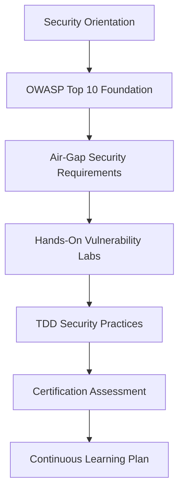

# Security Training Workflows for Enclave AI

## Overview

Automated security training workflows designed to build OWASP security expertise within development teams working on the Enclave AI platform. Focuses on practical, hands-on training with air-gap environment considerations.

## Training Workflow Categories

### 1. Onboarding Security Training

#### New Developer Security Bootcamp
**Duration**: 2 weeks
**Target Audience**: New team members
**Prerequisites**: Basic TypeScript/React knowledge



**Week 1: Foundation Knowledge**
- Day 1: Security orientation and air-gap requirements
- Day 2: OWASP A01 - Access control fundamentals
- Day 3: OWASP A02 - Cryptographic implementation
- Day 4: OWASP A03 - Injection prevention
- Day 5: Hands-on security lab exercises

**Week 2: Advanced Topics**
- Day 1: OWASP A07 - Authentication and session management
- Day 2: OWASP A09 - Security logging and monitoring
- Day 3: TDD security workflow implementation
- Day 4: Security testing and validation
- Day 5: Assessment and certification

#### Implementation
```bash
# Start new developer security bootcamp
/security-training --bootcamp --new-developer --duration 2weeks

# Day-by-day module progression
/security-training --bootcamp --day 1 --module security-orientation
/security-training --bootcamp --day 2 --module owasp-a01-access-control
# ... continue for all days

# Assessment and certification
/security-training --assessment --certification bootcamp-developer
```

### 2. Role-Based Training Tracks

#### Developer Track
**Focus**: Secure coding practices and vulnerability prevention

```yaml
modules:
  - secure_coding_fundamentals:
      topics:
        - Input validation patterns
        - Output encoding techniques
        - Error handling security
        - Session management
      duration: "4 hours"
      hands_on: true
      
  - injection_prevention:
      topics:
        - SQL injection prevention
        - Command injection security
        - XSS prevention in React
        - NoSQL injection protection
      duration: "6 hours"
      lab_exercises: 
        - "Fix SQL injection in user service"
        - "Secure command execution in security verifier"
        - "Implement XSS prevention in chat interface"
        
  - authentication_security:
      topics:
        - JWT implementation best practices
        - OAuth2 integration
        - Session security
        - MFA implementation
      duration: "4 hours"
      practical_implementation: true
```

#### Security Reviewer Track
**Focus**: Security assessment and code review expertise

```yaml
modules:
  - security_code_review:
      topics:
        - OWASP code review methodology
        - Automated security scanning
        - Manual security testing
        - Vulnerability assessment
      duration: "8 hours"
      
  - compliance_validation:
      topics:
        - SOC2 Type II requirements
        - GDPR compliance validation
        - HIPAA security requirements
        - PCI-DSS standards
      duration: "6 hours"
      
  - incident_response:
      topics:
        - Security incident handling
        - Forensic analysis basics
        - Communication procedures
        - Lessons learned integration
      duration: "4 hours"
```

#### Administrator Track  
**Focus**: Infrastructure security and system administration

```yaml
modules:
  - infrastructure_security:
      topics:
        - VPC security configuration
        - Container security hardening
        - Network segmentation
        - Monitoring implementation
      duration: "6 hours"
      
  - access_management:
      topics:
        - IAM policy management
        - Privilege escalation prevention
        - Administrative controls
        - Audit trail management
      duration: "4 hours"
      
  - compliance_operations:
      topics:
        - Continuous compliance monitoring
        - Audit preparation
        - Evidence collection
        - Reporting automation
      duration: "4 hours"
```

### 3. Just-in-Time Training

#### Incident Response Training
**Trigger**: Security incident detected
**Duration**: 1-2 hours
**Immediate Focus**: Specific vulnerability type

```bash
# Triggered automatically on incident detection
on_security_incident() {
  incident_type=$1
  affected_service=$2
  
  case $incident_type in
    "injection")
      /security-training --emergency --focus injection --service $affected_service
      ;;
    "authentication")
      /security-training --emergency --focus authentication --service $affected_service
      ;;
    "access-control")
      /security-training --emergency --focus access-control --service $affected_service
      ;;
  esac
}

# Example: Command injection incident
/security-training --emergency --focus injection --context "Command injection in security verifier" \
  --immediate-remediation --hands-on-fix
```

#### Pre-Feature Development Training
**Trigger**: New feature with security implications
**Duration**: 30 minutes - 2 hours

```bash
# Before developing authentication features
/security-training --pre-feature --feature-type authentication \
  --security-requirements "JWT implementation, MFA support" \
  --compliance-requirements "SOC2 CC6.1"

# Before implementing data processing
/security-training --pre-feature --feature-type data-processing \
  --security-requirements "Input validation, encryption at rest" \
  --compliance-requirements "GDPR Article 25, HIPAA 164.312"
```

### 4. Continuous Learning Programs

#### Weekly Security Spotlight
**Schedule**: Every Tuesday, 30 minutes
**Format**: Interactive session with current security topics

```yaml
schedule:
  week_1: "OWASP Top 10 Update Review"
  week_2: "New CVE Analysis and Impact"
  week_3: "Security Tool Deep Dive"
  week_4: "Compliance Requirement Updates"
  
format:
  - 10min: Topic presentation
  - 15min: Hands-on demonstration
  - 5min: Q&A and discussion
  
automation:
  trigger: "cron: 0 10 * * TUE"
  command: "/security-training --weekly-spotlight --auto-generate-content"
```

#### Monthly Security Challenges
**Schedule**: First Friday of each month
**Format**: Competitive security challenges

```bash
# Generate monthly security challenge
/security-training --challenge --monthly --difficulty progressive \
  --focus-areas "injection,authentication,access-control" \
  --leaderboard --team-competition

# Example challenge structure
monthly_challenge() {
  echo "🏆 Monthly Security Challenge: $(date '+%B %Y')"
  echo "Theme: OWASP A03 Injection Prevention"
  
  # Challenge 1: Find the vulnerability
  echo "Challenge 1: Identify injection vulnerabilities in provided code"
  
  # Challenge 2: Implement the fix
  echo "Challenge 2: Implement secure remediation"
  
  # Challenge 3: Create prevention tests
  echo "Challenge 3: Write security tests to prevent regression"
  
  # Scoring and leaderboard
  echo "Scoring: Speed + Accuracy + Test Coverage"
}
```

#### Quarterly Security Assessments
**Schedule**: End of each quarter
**Purpose**: Validate knowledge retention and skill progression

```bash
# Comprehensive quarterly assessment
/security-training --assessment --quarterly --comprehensive \
  --include-practical-exercises --certification-renewal \
  --individual-learning-plans

# Assessment structure
quarterly_assessment() {
  # Knowledge validation
  echo "📝 Part 1: OWASP security knowledge test (40 questions)"
  
  # Practical exercises  
  echo "🔧 Part 2: Hands-on vulnerability remediation (3 scenarios)"
  
  # Code review simulation
  echo "👀 Part 3: Security code review exercise (real codebase)"
  
  # Emergency response simulation
  echo "🚨 Part 4: Incident response simulation"
}
```

### 5. Specialized Training Modules

#### Air-Gap Security Training
**Focus**: Unique requirements of air-gapped environments

```yaml
module: air_gap_security
duration: "3 hours"
topics:
  - network_isolation_requirements:
      - VPC without internet gateway
      - PrivateLink endpoint configuration
      - Container network segmentation
      - Internal DNS resolution
      
  - offline_security_practices:
      - Local vulnerability scanning
      - Internal certificate management
      - Offline update mechanisms
      - Security tool deployment
      
  - compliance_in_air_gap:
      - Evidence collection methods
      - Audit trail maintenance
      - Regulatory requirement adherence
      - Documentation standards

practical_exercises:
  - "Configure secure VPC without internet access"
  - "Implement PrivateLink for AWS services"
  - "Set up offline security scanning"
  - "Create air-gap compliance checklist"
```

#### Container Security Training
**Focus**: Kubernetes and Docker security for Enclave platform

```yaml
module: container_security
duration: "4 hours"
topics:
  - container_hardening:
      - Minimal base images
      - Non-root user configuration
      - Resource limits and constraints
      - Security context configuration
      
  - runtime_security:
      - Container isolation verification
      - Security policy enforcement
      - Runtime monitoring
      - Incident response for containers
      
  - image_security:
      - Vulnerability scanning
      - Image signing and verification
      - Registry security
      - Supply chain security

hands_on_labs:
  - "Build secure container images"
  - "Configure security policies"
  - "Implement runtime monitoring"
  - "Respond to container security incidents"
```

### 6. Training Automation and Integration

#### CI/CD Integration
```yaml
# .github/workflows/security-training-enforcement.yml
name: Security Training Enforcement
on:
  pull_request:
    types: [opened, synchronize]
    
jobs:
  check_security_training:
    runs-on: ubuntu-latest
    steps:
      - name: Verify Developer Security Training
        run: |
          # Check if PR author has current security training
          /security-training --validate-certification --user ${{ github.actor }}
          
      - name: Security-Sensitive Change Detection
        run: |
          # Detect security-sensitive changes
          if grep -E "(password|secret|token|auth)" changed_files.txt; then
            /security-training --require-certification --security-sensitive
          fi
          
      - name: Automated Security Training Suggestion
        run: |
          # Suggest relevant training based on changes
          /security-training --suggest-training --based-on-changes changed_files.txt
```

#### Slack Integration
```bash
# Automated training notifications
security_training_bot() {
  # Daily security tip
  curl -X POST $SLACK_WEBHOOK \
    -d "$(security-training --daily-tip --format slack)"
    
  # Training deadline reminders
  curl -X POST $SLACK_WEBHOOK \
    -d "$(security-training --deadline-reminders --format slack)"
    
  # Security incident training triggers
  curl -X POST $SLACK_WEBHOOK \
    -d "$(security-training --incident-training --format slack)"
}

# Schedule in cron
# 0 9 * * * security_training_bot
```

#### Learning Management System Integration
```typescript
// LMS API integration for tracking and reporting
export class SecurityTrainingLMS {
  async recordTrainingCompletion(
    userId: string,
    moduleId: string,
    score: number,
    completionTime: number
  ): Promise<void> {
    // Record completion in learning management system
    await this.lmsApi.post('/training/completions', {
      userId,
      moduleId,
      score,
      completionTime,
      timestamp: new Date()
    });
  }

  async generateProgressReport(userId: string): Promise<TrainingReport> {
    // Generate comprehensive training progress report
    const completions = await this.lmsApi.get(`/users/${userId}/completions`);
    const assessments = await this.lmsApi.get(`/users/${userId}/assessments`);
    
    return {
      overallProgress: this.calculateProgress(completions),
      strengths: this.identifyStrengths(assessments),
      improvementAreas: this.identifyGaps(assessments),
      recommendedTraining: this.recommendNextSteps(completions, assessments)
    };
  }
}
```

### 7. Training Effectiveness Measurement

#### Metrics Collection
```typescript
export interface TrainingMetrics {
  completion_rates: {
    overall: number;
    by_role: Record<string, number>;
    by_module: Record<string, number>;
  };
  
  knowledge_retention: {
    immediate_assessment: number;
    30_day_retention: number;
    90_day_retention: number;
  };
  
  practical_application: {
    vulnerability_detection_improvement: number;
    secure_code_increase: number;
    incident_response_time_reduction: number;
  };
  
  business_impact: {
    security_incident_reduction: number;
    compliance_score_improvement: number;
    developer_confidence_increase: number;
  };
}

// Automated metrics collection
export class TrainingMetricsCollector {
  async collectCompletionMetrics(): Promise<CompletionMetrics> {
    // Collect training completion data
  }
  
  async measureKnowledgeRetention(): Promise<RetentionMetrics> {
    // Measure knowledge retention over time
  }
  
  async assessPracticalApplication(): Promise<ApplicationMetrics> {
    // Assess real-world application of training
  }
}
```

#### Continuous Improvement Process
```yaml
improvement_cycle:
  monthly_review:
    - Analyze completion rates
    - Review assessment scores
    - Collect feedback from participants
    - Identify content gaps
    
  quarterly_updates:
    - Update training content based on new vulnerabilities
    - Revise modules based on effectiveness metrics
    - Add new training scenarios
    - Improve delivery methods
    
  annual_overhaul:
    - Comprehensive curriculum review
    - Industry benchmark comparison
    - Technology stack updates
    - Training methodology enhancement

feedback_collection:
  immediate: "Post-module survey (2 questions)"
  weekly: "Training experience feedback"
  monthly: "Curriculum relevance assessment"
  quarterly: "Training program evaluation"
```

This comprehensive training workflow framework ensures continuous security education and skill development for all team members working on the Enclave AI platform.